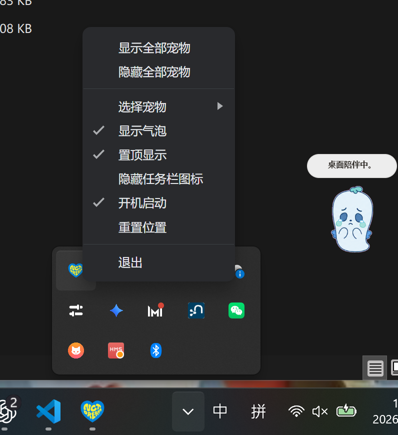

# DREAM Pets 使用说明

这是一个包含 7 只 NCT DREAM 桌宠的小应用。

## 下载说明

### Windows

- `DREAM-Pets-win11-1.1.0.exe`
  - 免安装版本，下载后直接点击即可运行

- `DREAM-Pets-win11-Setup-1.1.0.exe`
  - 安装版，下载后按照指引选择目录进行安装（推荐）

### macOS

- `DREAM.Pets-1.1.0-arm64.dmg`
  - M 系列芯片下载这个

- `DREAM.Pets-1.1.0-x64.dmg`
  - Intel 芯片下载这个

## 安装提示

- Windows 双击 exe 文件，选择目录安装。
- Windows 可能提示“未知发布者”或 SmartScreen 安全提示，这是未签名个人应用的正常现象。可以选择管理员模式运行或者私信我。
- 安装器会创建桌面快捷方式和开始菜单快捷方式，名称均为 `DREAM Pets`。
- macOS 安装如果出现安全权限问题不会解决，可以私信问我。

## macOS 提示“文件已损坏”怎么办

如果 macOS 安装后提示“文件已损坏”或“无法打开”，可以按下面步骤处理：

1. 先双击打开 `.dmg` 安装包。
2. 把里面的 `DREAM Pets.app` 拖到 `应用程序 / Applications` 里。
3. 不要直接在 `.dmg` 里打开软件。
4. 打开 Mac 的“终端 Terminal”。
5. 复制下面这条命令，粘贴到终端里，然后按回车：

```bash
sudo xattr -rd com.apple.quarantine "/Applications/DREAM Pets.app"
```

6. 这时会让你输入 Mac 开机密码。输入密码的时候，终端不会显示任何字符，这是正常的。正常输入完密码后按回车即可。
7. 然后再去“应用程序”里打开 DREAM Pets.app。

## 基础功能

- 右键宠物可以打开控制面板。
- 双击宠物可退出陪伴模式。

### 控制面板功能

- `选择宠物`：支持同时勾选多只宠物，同时显示。
- `隐藏全部宠物`：只会隐藏宠物，不会退出应用；托盘仍会保留。
- `重命名宠物`：支持编辑宠物显示名称。
- `编辑气泡文字`：支持编辑气泡台词，一行一句。
- `显示气泡`：切换显示/隐藏头顶悬浮台词。
- `置顶显示`：让宠物窗口保持在最上层。
- `重置位置`：重置宠物位置。
- `巡逻模式`：让宠物在桌面上自动左右巡回。
- `开机启动`：默认勾选，开机后自动启动。
- `隐藏 Dock 图标` / `隐藏任务栏图标`：将应用图标从 Dock 或任务栏隐藏，托盘中仍然保留。
- `下一句气泡`：切换到下一句气泡台词。
- `缩放宠物`：可选择小 / 中 / 大。
- `关闭这只宠物`：关闭当前这只宠物。
- `退出`：退出应用。

### 托盘位置



- Windows 托盘在屏幕右下角。
- macOS 托盘在屏幕上方菜单栏，点击 `DREAM Pets` 打开下拉菜单。

## 宠物操作

- 鼠标左键单击宠物：触发 `跳跃` 动作。
- 鼠标左键拖动宠物：移动宠物位置。
- 向左拖动：显示 `向左走` 动作。
- 向右拖动：显示 `向右走` 动作。
- 鼠标滚轮：缩放宠物，范围约为 35% 到 70%。
- `待机`：待机状态。
- `等待`：等待状态。
- `失败`：伤心状态。
- `忙碌`：忙碌状态。
- `检查`：思考状态。
- `挥手`：招手状态。

## 巡逻模式

- 在控制面板或托盘菜单中打开 `巡逻模式`。
- 打开后，宠物会在桌面上自动向左或向右走动。
- 行走时会播放对应的 `向左走` 或 `向右走` 动画。
- 关闭巡逻模式后会回到 `待机` 状态。