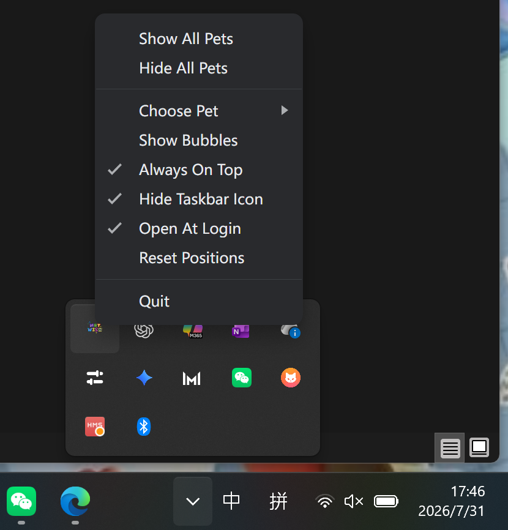

# wish Pets使用说明

这是一个包含 6 只 nct wish 桌宠的小应用。

## 下载说明

### Windows

- `NCT-WISH-Pets-win11-Setup-1.1.2.exe`
  - 当前推荐版本。(安装版)

- `NCT-WISH-Pets-win11-1.1.2.exe`
  - 如果不行的话可以下载这个版本。（免安装便携版）

### macOS
- `NCT.WISH.Pets-1.1.2-arm64.dmg`
  - M系列芯片下载这个

- `NCT.WISH.Pets-1.1.2-x64.dmg`
  - Intel芯片下载这个

## 安装提示

- Windows双击 exe 文件，选择目录安装。
- Windows 可能提示“未知发布者”或 SmartScreen 安全提示，这是未签名个人应用的正常现象。可以选择管理员模式运行或者私信我。
- 安装器会创建桌面快捷方式和开始菜单快捷方式，名称均为 `wish Pets`。
- macos安装如果出现安全权限问题不会解决可以私信问我。
- macos如果遇到已损坏：
打开终端，输入：sudo xattr -rd com.apple.quarantine "/Applications/wish Pets.app"
按回车后，如果让你输入电脑密码，就输入开机密码再按回车。输入密码时屏幕不会显示任何字符，这是正常的。完成后重新打开 wish Pets。

## 基础功能

- 右键或双击宠物可以打开控制面板。

### 控制面板功能

- `Choose Pet`支持同时勾选多只宠物，同时显示。
- `Hide All Pets` 只会隐藏宠物，不会退出应用；托盘仍会保留。
- `Rename Pet` 支持编辑宠物显示名称。
- `Edit Bubble Text` 支持编辑气泡台词，一行一句。
- `Show Bubbles` 切换显示/隐藏头顶悬浮台词。
- 支持 `Always On Top` 置顶。
- 支持 `Reset Positions` 重置宠物位置。
- 支持 `Patrol Mode` 定期巡回模式。
- 默认勾选 `Open At Login` 开机自动启动。
- `Hide Dock Icon` 将应用图标从电脑下边栏隐藏，托盘中仍然保留。
- `Save Pet Text`：保存名称和气泡台词。
- `Quit`：退出应用。
- `Close Panel`：关闭控制面板，但不退出应用。

### 托盘位置

 - macos托盘在屏幕左上角H2H Pets那里点开下拉框

## 宠物操作

- 鼠标左键单击宠物：触发 `jumping` 跳跃动作。
- 鼠标左键拖动宠物：移动宠物位置。
- 向左拖动：显示 `running-left` 动作。
- 向右拖动：显示 `running-right` 动作。
- 鼠标滚轮：缩放宠物，范围约为 25% 到 60%。
- `idle` 待机状态
- `waiting` 等待状
- `failed` 伤心状态
- `busy` 忙碌状态
- `running`运行状态
- `review` 思考状态
- `wave` 招手状态

## 巡回模式

- 在控制面板或托盘菜单中打开 `Patrol Mode`。
- 打开后，空闲宠物会定期向左或向右走一小段。
- 行走时会播放对应的 `running-left` 或 `running-right` 动画。
- 巡回结束后会自动回到 `idle` 状态。
